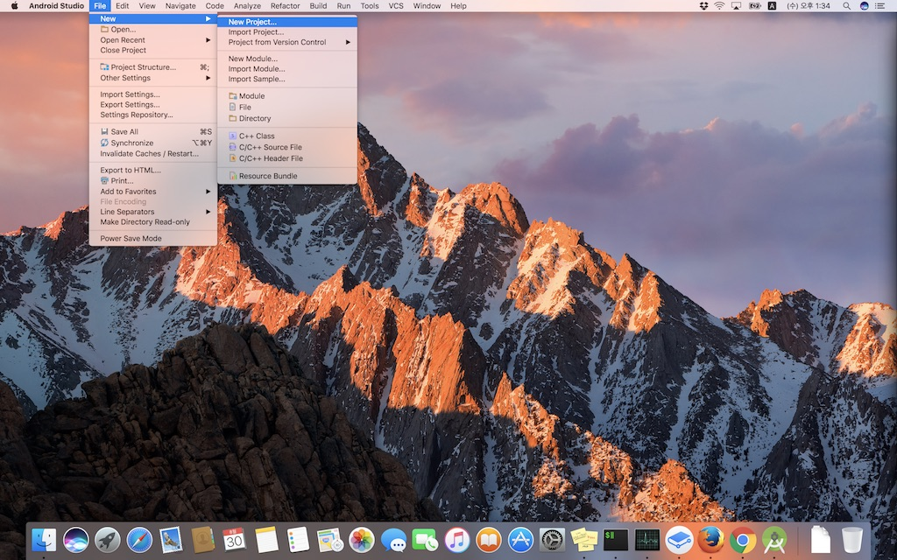
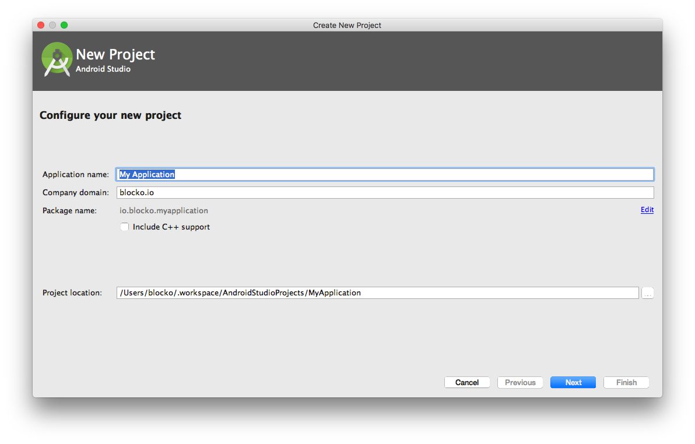
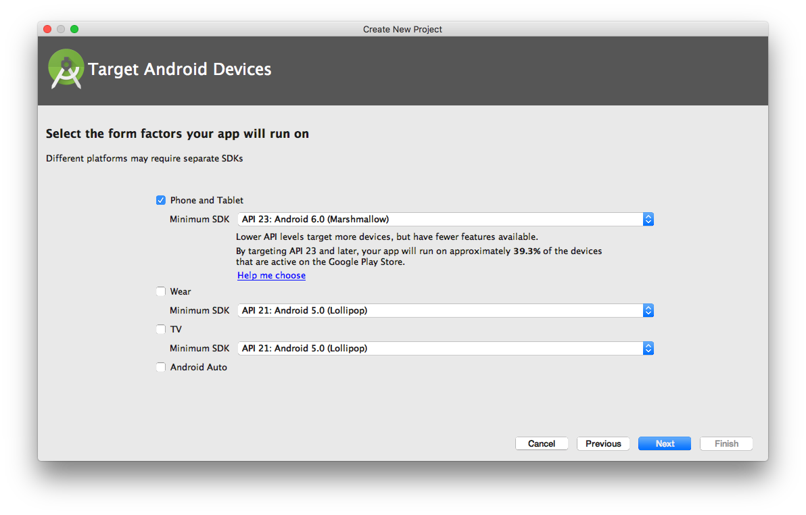
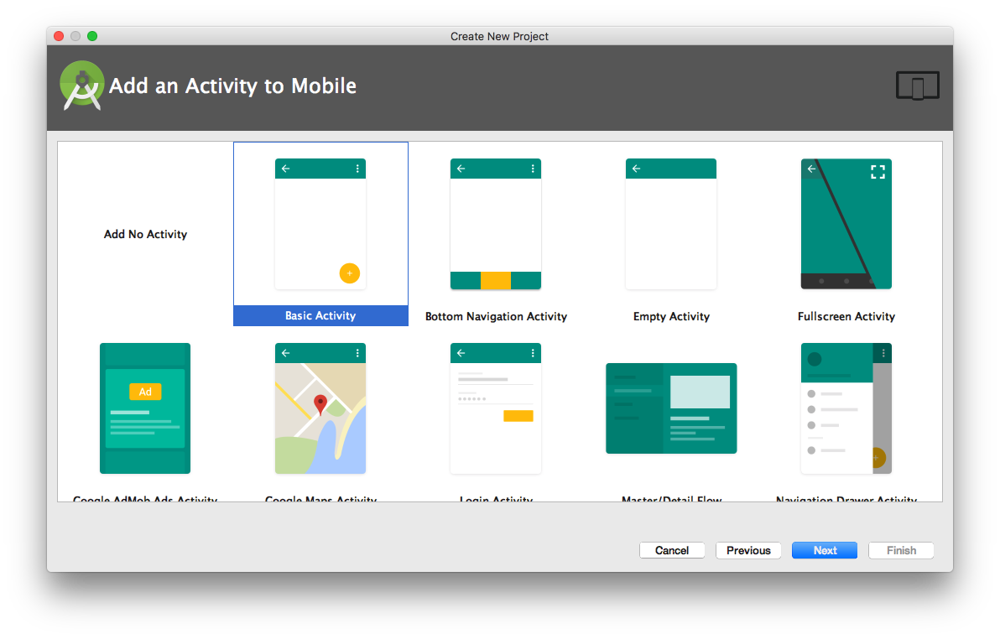
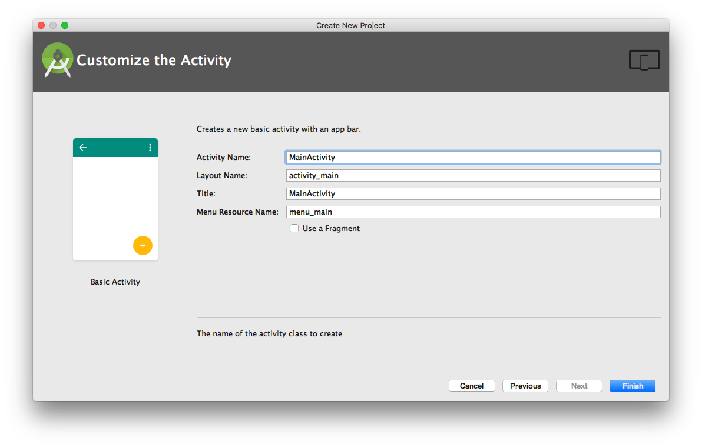

# 프로젝트 생성하기

Android Studio에서 프로젝트를 생성하는 것으로 부터 시작한다. 메뉴에서 "New &gt; New Project..." 을 선택한다.

프로젝트 이름을 입력한다.

대상 플랫폼과 버젼을 선택한다.

생성할 앱 템플릿을 선택한다.

앱 템플릿에서 필요로 하는 이름등을 지정한다.

종료 버튼을 누르고 이상없이 프로젝트가 생성되었는지 확인한다.

